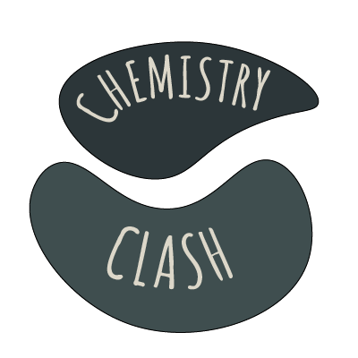

<h1 align="center">Chemistry clash</h1>

<h2>📰About</h2>

The conception of our <b>game</b> is to save the world from <b>pollution</b>. Your name is <b>The ecological captain</b> and you have to solve different kinds of chemical exercises to gain abilities and defeat the <b>villains of pollution</b>.

<h2>📷Screenshots</h2>

<h2>📥Installation</h2>

1.Open a terminal on you local machine and clone the repository by the link bellow.

2.Run the application and you are ready to go!

<pre>https://github.com/TYAtanasov21/Chemistry_Clash.git</pre>

<h2>📃Documents</h2>
<h3>Documentation</h3>
<ul>
<li><a href="documents/Documentation - Chemistry clash.docx" download>Documentation</a></li>
</ul>
<h3>Presentation</h3>
<ul>
<li><a href="documents/Presentation - Chemistry clash.pptx" download>Presentation</a></li>
</ul>

<h2>🖥️Technologies</h2>
<h3> Code editors and collaborative services used:</h3>

    
    
    
    
    
    

<h3>Programming languages:</h3>

    
    

<h3>Softwares used for visual elements:</h3>
    
    
<h3>Used programs for creating documentation and presentation:</h3>

  
  
   

<h2 align = "left">🧒Our team</h2>
<ul>
<li><a href = "https://github.com/TYAtanasov21"> Todor Atanasov </a>[Scrum trainer]  </li>
<li><a href = "https://github.com/AZKazakov21"> Alex Kazakov </a> [Back-end developer] </li>
<li><a href = "https://github.com/IDDochev21"> Ivan Dochev </a> [Back-end developer]  </li>
<li><a href = "https://github.com/MTNenkov21"> Martin Nenkov </a>[Designer]  </li>
</ul>

<h3 align = "center">Thank you for checking out our repo! If you had a good time you can leave us a ⭐!</h3>